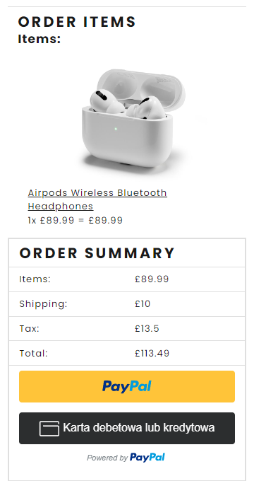

<script type="module" src="./node_modules/@github/clipboard-copy-element/dist/index.js">
<h1>Masta eCommerce</h1>
  

<h3>E-commerce platform build with <h3>

  

    
    React
  

  

    
    MongoDB
  

  

    
    Express
  

<h3>Fully Responsive Website</h3>

  
  

<h3>Admin Panels</h3>

  
  

<h3>Run</h3>

# Frontend (:3000), Backend (:5000)

npm run dev

# Run backend only

npm run server

<h3>Login</h3>
# Sample User Logins

Login as admin
email: admin@example.com 
password: 123

Paypal
email: sb-autpc13044434@personal.example.com
password: 0S4^$sTc

